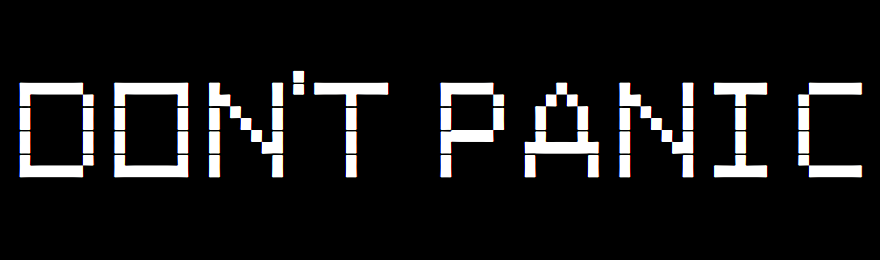

<h2>What is This?</h2>

This project was adapted from the original OneLifeXcompile as an attempt to provide
a simple way for to provide the tool for anyone to build, modify and even contribute
to the game Two Hours One Life.

<h2>Before You Start</h2>

Windows Subsystem for Linux (WSL) was the main tool used for testing of the scripts
in this repository. Other tools such as Virtual box may be able to make use of the
scripts here, but have in mind it might not work. WSL 2 was not tested.

You can see a guide on how to activate WSL on Windows 10 here: 
<a href="https://docs.microsoft.com/en-us/windows/wsl/install-win10">WSL Installation Guide for Windows 10</a>

If your in a hurry enter the folder exclude-dir in this repository and then run the batch file
'activateWSLthenRestart.bat' as an administrator. Be warned it will restart your machine. 
After you computer reboots install <a href="https://www.microsoft.com/store/apps/9n6svws3rx71">Ubuntu 20.04 LTS</a> from the Microsoft
store. Open it and define a user and password. 

<h2>Do I have to read all of the following? This stuff is boring, why can't I just build the game?</h2>

I got you, fam. Run this from wsl:  
<code>wget https://raw.githubusercontent.com/Defalt36/TwoLifeXcompile/master/doEverything.sh;./doEverything.sh</code>

<h2>Preparing Your Work Directory</h2>

After you set up WSL on your machine open the CMD and type 'wsl' and you should see
the terminal of your linux distribution. Alternatively you can run 'openTerminalHere.bat'
from the repository files.

If you don't already have a work directory create a folder and name it 'workdir', then move
the 'TwoLifeXcompile' repository to it or proceed to get instructions on how to acquire it.

To download the repository directly to your workdir first open WSL from CMD. Then use the
command 'cd' to navigate to the folder you want to place your files. In
my case I use '<code>cd /mnt/c/Users/defalt/Desktop/workdir</code>' as that is where my workdir
is located. '/mnt/c' is the corresponding path of C: on WSL. 

Now run '<code>sudo apt-get install git</code>', wait for it to complete and then run
'<code>git clone https://github.com/Defalt36/TwoLifeXcompile.git</code>'.
After the command completes, check to see if 'TwoLifeXcompile' was cloned into the right folder.

For convenience you can type: 
<code>ln -s "The path to your work directory" ~/workdir</code> 

This create a shortcut that will let you find you work directory easily using: 
<code>cd ~/workdir</code>

<h2>Preparing Your Enviroment</h2>

The following scripts will install the required components to build the game in your
linux distribution. You just have to run then once as long as you don't uninstall or
use another distribution.

Make sure you have the correct folder opened in the terminal. Check the end of the line
to see if you are in the TwoLifeXcompile folder.
For me it is:  
<code>defalt@DEFALT-PC:/mnt/c/Users/defalt/Desktop/workdir/TwoLifeXcompile</code> 

Run: 
<code>./getBasics.sh</code> 
<code>./installMingw.sh</code> 

Run this if you want to be able to build the editor: 
<code>./installMissingLibraries.sh</code> 

<h2>Preparing The Game Files</h2>

First you will have to clone the game files. The command <code>./removeAndCloneAgain.sh</code>
should do this for you, but have in mind it will delete the game repositories you
previously cloned (if any). 

Note that command will clone the minorGems, OneLife and OneLifeData7 repositories from the
TwoHoursOneLife github account. To clone from other sources you can use:
<code>./cloneAlternative.sh</code>. 

After successfully cloning the game repositories to your work directory run: 
<code>./getSDLforMingw.sh</code> 
<code>./fixStuff.sh</code> 
<code>./applyLocalRequirements.sh</code> 

<h2>Building The Game</h2>

Before you start, if you already tried to compile anything run this command to remove
the files generated from previously builds. 
<code>./cleanOldBuilds.sh</code>

Now you are ready for compiling the game. You have currently four basic options on how
to do this using the repository scripts.

<ol>
<li><code>./compileAndMove.sh</code></li>
<li><code>./compileWithoutEOLChanges.sh</code></li>
<li><code>./buildTestSystem.sh</code></li>
</ol>

'compileAndMove.sh' will compile the game using the scripts that were copied to OneLife/build,
and then move the game to the folder windows_builds in your work directory. 

'compileWithoutEOLChanges.sh' will do basically the same as the first but it is much faster. The
reason for this is that it does not convert the unix-style line endings to windows-style. It
doesn't seem to cause any major problems. 

'buildTestSystem.sh' is very similar to pullAndBuildTestSystem.sh from the OneLife scripts; In
fact, it is derived from it. It will clone the game repositories if they are missing and compile
the game, editor and server for you, modifing some files so it will be ready to be used for
testing. Be warned you will be editing the repositories files when you use the editor. You may
want to make a backup of the OneLifeData7 repository.

'createFullBuild.sh' this last one will compile the game, server and editor and move all their
files to a single folder in order to make a full build. If you are using this, remember to run
the 'initiateServer.bat' file before running the server. 'resetServer.bat' is included to delete
the server files if you are unable to run it due to a crash.

<h2>Building From Another Source</h2>

You can run './cloneAlternative.sh' to clone from the game repositories under any name from
any user. This is useful for cloning your own repositories. You can also clone the original game
repositories with it if you input 'jasonrohrer' as the user you want to clone from. 
The compile script recomended when building from other sources is 'buildTestSystem.sh'.

<h2>Ok, But What Does All This Stuff Actually Do?</h2>

Most forked scripts keep the same function as the original ones, and others were renamed. You can read about what
they do in this tutorial from the creator of the original project, Joriom:
https://onehouronelife.com/forums/viewtopic.php?id=1438

<code>exclude-list.txt</code> 
When you run ./applyLocalRequirements.sh some files from TwoLifeXcompile will be copied to
the game folders with the sole exception being the files listed here. The folder exclude-dir
and some files you may use are included for your convenience.

<code>fixStuff.sh</code> 
The next script fix some paths in the game repositories that prevent you from compiling
the game components. Alternatively you could create symlinks for correct paths in your
system, but if you want to keep it simple, just run it.

<code>cloneAlternative.sh</code> 
Used for cloning from other repositories, branches or users.

<code>installMissingLibraries.sh</code> 
You may have a lot of libraries in your system, but it seems you have to have them installed
at your compiler for it to work. This script install the ones you need.

<code>installMissingLibraries.sh --sdlonly</code> 
Experimental.
This will install sdl in your distribution instead.
You will have to replace some files from the repository folder minorGems/game/plataforms/SDL
with their counterparts in exclude-dir.

<code>deleteAllServerFiles.sh</code> 
Forget to press control-c when exiting the server or you just want a fresh map? This script
will send all your server files to oblivion.

<code>cleanServerMap.sh</code> 
Less destructive version of the above.

<code>pullAndBuildLatestWindows.sh</code> 
Will automatically build the lastest version of Two Hours One Life for you. Make sure to
get SDL before running.

<code>buildTestSystem.sh</code> 
It will clone missing repositories if any and build a test system for experimenting with
the game. As the preceding you need SDL before running this.

<code>createFullBuild.sh</code> 
Build the game, editor and server and puts them in a single folder.

<code>doEverything.sh</code> 
Will install, download and run everything you need, then it will
build the game, editor and server. This should be run at your workdir.

<h2>Note About Missing DLLs</h2>

After some time I started getting an error when starting the editor. It says I miss
some dlls from libSDL, libpng and libz. 

If you experience that problem, just copy the dlls from 'OneLife/build/win32' from this
repository to the same folder as the exe requiring these files. 

Removing the "OneLife/build/win32" line from 'exclude-list.txt' should include
these files in '2hol_(x)' the next time you compile the game (now default).

